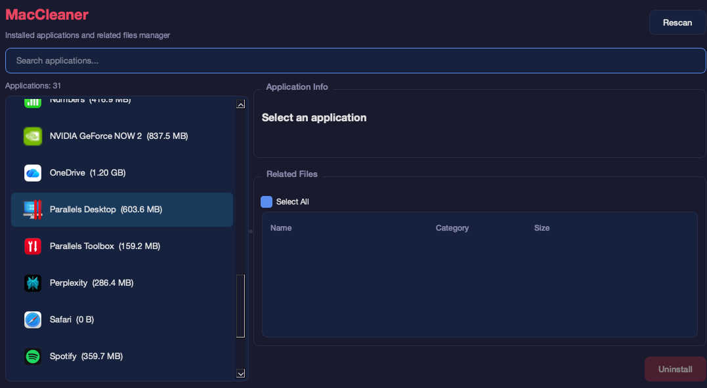

# MacCleaner

> macOS Application Uninstaller — Completely remove apps and their leftover files.



macOS has no built-in uninstaller like Windows "Add or Remove Programs."
When you drag an app to Trash, config files, caches, and logs remain on your system.
**MacCleaner** finds and removes all related files for a clean uninstall.

---

## Features

- **Full App Scan** — Scans `/Applications` and `~/Applications` with app icons, version, and size
- **Related File Detection** — Automatically finds leftover files in:
  - `~/Library/Preferences/`
  - `~/Library/Application Support/`
  - `~/Library/Caches/`
  - `~/Library/Logs/`
  - `~/Library/Containers/`
  - `~/Library/Group Containers/`
  - `~/Library/Saved Application State/`
  - `~/Library/HTTPStorages/`
  - `~/Library/Cookies/`
  - `~/Library/WebKit/`
- **Selective Removal** — Choose which related files to remove with checkboxes
- **Size Calculator** — Shows total size (app + related files) before removal
- **Search** — Quickly filter through installed applications
- **Admin Privileges** — Requests administrator password when needed for system apps

---

## Installation

### Download DMG

1. Go to [Releases](../../releases)
2. Download `MacCleaner.dmg`
3. Open the DMG and drag **MacCleaner** to **Applications**
4. On first launch: **Right-click → Open** (required for unsigned apps)

### First Launch Security

Since this app is not notarized with Apple, macOS will show a security warning.

**Option 1**: Right-click the app → Click "Open" → Click "Open" again

**Option 2**: System Settings → Privacy & Security → Click "Open Anyway"

---

## Requirements

- macOS 12.0 (Monterey) or later
- Apple Silicon (M1/M2) or Intel Mac

---

## Usage

1. Launch **MacCleaner**
2. The app automatically scans all installed applications
3. Click an app to see its details and related files
4. Check/uncheck files you want to remove
5. Click **Uninstall** to remove the app and selected related files
6. Confirm the deletion in the dialog

---

## Building from Source

```bash
# Clone the repository
git clone https://github.com/YOUR_USERNAME/MacCleaner.git
cd MacCleaner

# Create virtual environment
python3 -m venv venv
source venv/bin/activate

# Install dependencies
pip install PyQt6 py2app Pillow

# Run directly
python mac_cleaner.py

# Build .app bundle
python setup.py py2app

# Create DMG
mkdir dmg_tmp
cp -R dist/MacCleaner.app dmg_tmp/
ln -s /Applications dmg_tmp/Applications
hdiutil create -volname "MacCleaner" -srcfolder dmg_tmp -ov -format UDZO dist/MacCleaner.dmg
rm -rf dmg_tmp
```

---

## Tech Stack

| Component | Technology |
|-----------|-----------|
| Language | Python 3 |
| GUI Framework | PyQt6 |
| Packaging | py2app |
| Installer | DMG (hdiutil) |

---

## License

MIT License — See [LICENSE](LICENSE) for details.

---

## Contributing

Pull requests are welcome. For major changes, please open an issue first.
